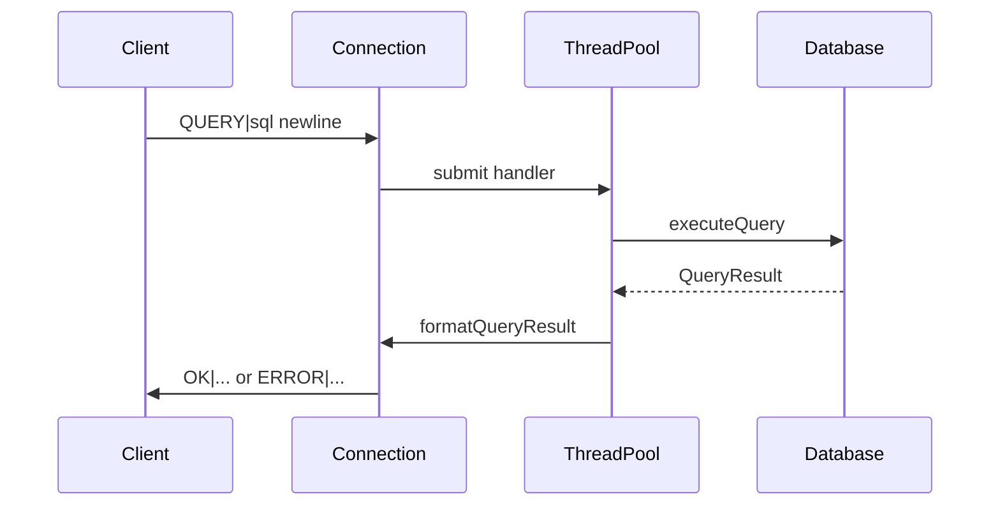

# Educational SQL Engine with Network Server

A modular **C++17** database server: parsing a subset of SQL, in-memory table operations, binary on-disk persistence, and **TCP** access via a simple text protocol. The project is aimed at learning how database engines work, not at production workloads.

---

## Table of contents

- [Features](#features)
- [Stack and dependencies](#stack-and-dependencies)
- [Project structure](#project-structure)
- [Build](#build)
- [Running](#running)
- [Troubleshooting](#troubleshooting)
- [Network protocol](#network-protocol)
- [Persistence](#persistence)
- [Supported SQL](#supported-sql)
- [Architecture](#architecture)
- [Concurrency and performance](#concurrency-and-performance)
- [SQL examples](#sql-examples)
- [Logging and errors](#logging-and-errors)
- [Limitations and future work](#limitations-and-future-work)
- [Extending the codebase](#extending-the-codebase)
- [Statistics (approximate)](#statistics-approximate)
- [License and references](#license-and-references)

---

## Features

### Fully supported by the executor

- **CREATE TABLE** — schema with types and `PRIMARY KEY`, `UNIQUE`, `NOT NULL` constraints.
- **INSERT** — one or many rows; explicit column list or table column order.
- **UPDATE** / **DELETE** — optional **WHERE** and expressions in `SET`.
- **SELECT** — single table in **FROM**, column list or `*`, **WHERE**, expressions in the SELECT list (arithmetic, column references), **DISTINCT**.
- Built-in scalar functions in SELECT expressions: **COUNT** (simplified semantics: returns `1` per row when an argument is present), **UPPER**, **LOWER**, **LENGTH**.
- **Types**: `INT`, `FLOAT`, `STRING`, `BOOLEAN`, `DATE`, `UUID` and synonyms from [`DataType.h`](include/types/DataType.h) (`INTEGER`, `REAL`, `TEXT`, `VARCHAR`, `BOOL`).
- **Persistence**: directory of binary table files; successful mutations trigger a save.
- **Network**: multi-client TCP server; **QUERY**, **PING**, **QUIT** commands.
- **Client**: interactive mode and batch execution from a `.sql` file.

### Parsed by the lexer/parser but not applied by the SELECT executor

These constructs are represented in the AST ([`SelectStatement`](include/parser/AST.h)), but [`SelectExecutor`](src/executor/QueryExecutor.cpp) does **not** apply them to the result:

- **JOIN** (`INNER` / `LEFT` / `RIGHT`, and bare `JOIN` treated as inner join at parse time).
- **GROUP BY**, **HAVING**, **ORDER BY**, **LIMIT**, **OFFSET**.
- Full **SUM**, **AVG**, **MIN**, **MAX** aggregates (tokens exist in the lexer; the SELECT executor has no grouping logic for them).

Treat the current **SELECT** as **single-table** with filtering and **DISTINCT**.

### C++ API only, not SQL

- **`Database::dropTable`** removes a table from memory and from the persisted file set on the next save; there is no **`DROP TABLE`** statement in the SQL parser.

---

## Stack and dependencies

| Component | Details |
|-----------|---------|
| Language | C++17 |
| Build | [Makefile](Makefile), `g++` |
| Platform | Linux / POSIX (`pthread`, Berkeley sockets) |
| Dependencies | C++ standard library only—no third-party libraries |

Server entry point: [`main.cpp`](main.cpp). Port **9000** and thread-pool size **4** are hard-coded literals; change defaults by editing the `Server(...)` call in `main.cpp` (or add CLI argument parsing).

---

## Project structure

```
lesson_47/
├── include/
│   ├── core/          # Database, Table, Row, Column
│   ├── parser/        # Lexer, Parser, AST, Token
│   ├── executor/      # QueryExecutor and implementations
│   ├── storage/       # PersistenceManager
│   ├── threading/     # ThreadPool, WorkQueue
│   ├── network/       # Server, Connection, Protocol
│   ├── types/         # Value, DataType, TypeConverter
│   └── utils/         # Logger, Exceptions
├── src/               # Implementations (.cpp), mirrors include/
├── client/
│   └── cli_client.cpp # TCP client
├── data/              # Table files (created at runtime)
├── main.cpp
├── Makefile
└── README.md
```

---

## Build

### `make` targets

| Target | Action |
|--------|--------|
| `make` / `make all` / `make build` | Build server → `bin/db_server` |
| `make server` | Same, with a success message |
| `make client` | Build client → `bin/db_client` |
| `make run` | Build and run the server |
| `make client-run` | Build and run the client (interactive) |
| `make demo` | Server in background, runs temporary SQL from `build/demo_queries.sql`, then stops server |
| `make clean` | Remove `build/` and `bin/` |
| `make data-clean` | Remove `data/` |
| `make distclean` | `clean` + `data-clean` |
| `make help` | Short help for targets |

Compiler flags: `-std=c++17 -Wall -Wextra -O2 -I.`, link with `-pthread`.

---

## Running

**Terminal 1 — server:**

```bash
make run
# listens on all interfaces (INADDR_ANY), port from main.cpp (default 9000)
# stop: Ctrl+C (SIGINT)
```

**Terminal 2 — client:**

```bash
make client-run
```

Batch mode:

```bash
./bin/db_client path/to/queries.sql
```

Lines starting with `#` and empty lines are ignored. A statement is assembled until a line ends with `;`.

---

## Troubleshooting

| Symptom | Likely cause |
|---------|----------------|
| `Failed to bind socket` | Port in use or previous server still holding it—change the port in `main.cpp` or free the port (`SO_REUSEADDR` is already enabled). |
| Client: `Connection failed` | Server not running, or wrong host/port in `cli_client.cpp` (defaults: `127.0.0.1:9000`). |
| Empty or truncated response | Query or result larger than the receive buffer—see [Network protocol](#network-protocol). |
| Data missing after `Ctrl+C` | Saves run after successful **INSERT**/**UPDATE**/**DELETE**/**CREATE TABLE**; abrupt termination may leave files at the last successful save only. |
| Compile errors | Need a **C++17** compiler and POSIX headers (`unistd.h`, `sys/socket.h`). |

---

## Network protocol

Client messages are UTF-8 lines terminated by `\n`. Server-side parsing: [`Protocol::parseRequest`](include/network/Protocol.h).

### Requests

| Kind | Format | Action |
|------|--------|--------|
| SQL | Line built like the CLI: protocol verb **QUERY**, a delimiter ASCII `\|` (U+007C), the SQL text, then LF `\n` | Run SQL via [`Database::executeQuery`](src/core/Database.cpp) |
| Health check | **PING** + `\|` + payload + `\n` — delimiter required (`Protocol::parseRequest`) | Response `PONG\n` |
| Quit | **QUIT** + `\|` + payload + `\n` | Response `OK|Goodbye\n`, session ends |

[`cli_client.cpp`](client/cli_client.cpp) sends **`QUERY|...`** only.

### Responses

- Success: prefix **`OK|`**, then newline; first line is column names separated by **tab** `\t`; following lines are result rows, fields separated by `\t`. Implementation: [`Protocol::formatResponse`](src/network/Protocol.cpp).
- Error: **`ERROR|<text>\n`**.

Limitation: a single read is capped at **4096** bytes on the server ([`Connection::readMessage`](src/network/Server.cpp)) and **8192** bytes on the client when receiving—large queries or wide results need protocol changes (framing / length prefix).

### QUERY execution flow



---

## Persistence

- Default directory: **`data/`** ([`Server`](include/network/Server.h) constructor argument).
- On startup: [`Database::loadFromDisk`](src/core/Database.cpp) → [`PersistenceManager::loadDatabase`](include/storage/PersistenceManager.h).
- After successful **INSERT**, **UPDATE**, **DELETE**, **CREATE TABLE**, all tables are saved ([`persistAfterMutation`](src/core/Database.cpp)).
- File format: magic **`0x44425442`** (`"DBTB"`), version **1** ([`PersistenceManager`](include/storage/PersistenceManager.h)).

---

## Supported SQL

### DDL

- **`CREATE TABLE`** — column definitions with types and modifiers.

### DML

- **`INSERT INTO`** — `VALUES` for one or more rows.
- **`SELECT`** — see [Features](#features): single table, **WHERE**, **DISTINCT**, expressions and the listed functions.
- **`UPDATE`** / **`DELETE`** — optional **WHERE**.

### Expressions in WHERE and SELECT

Comparisons, logical **AND** / **OR**, **NOT**, arithmetic `+ - * / %`, parentheses via the AST. Column identifiers and literals follow the parser rules.

---

## Architecture

### Layers

1. **Client** — TCP connect, protocol lines, pretty-print (tabs shown as spaces).
2. **Network** — `accept` thread; per-client read thread [`Connection`](src/network/Server.cpp); work submitted to **`ThreadPool`**; implementation waits for each task before reading the next message on the same socket.
3. **Parser** — [`Lexer`](src/parser/Lexer.cpp) → [`Parser`](src/parser/Parser.cpp) → AST ([`AST.h`](include/parser/AST.h)).
4. **Routing** — [`Database::executeQuery`](src/core/Database.cpp) dispatches by statement type to `executeSelectStatement`, `executeInsertStatement`, etc.
5. **Execution** — [`QueryExecutor`](include/executor/QueryExecutor.h) classes: `SelectExecutor`, `InsertExecutor`, `UpdateExecutor`, `DeleteExecutor`, `CreateTableExecutor`.
6. **Storage** — [`Table`](include/core/Table.h) / [`Row`](include/core/Row.h) / [`Column`](include/core/Column.h); serialization via `PersistenceManager`.

### Patterns (conservative wording)

- **Strategy-like** split: separate executor classes sharing `QueryExecutor`.
- **Singleton**: [`Logger`](include/utils/Logger.h) only (`Logger::getInstance()`).
- **`Database`** is **not** a singleton: one instance per **`Server`**, passed into connections by pointer.
- Session teardown: `std::function` callback to unregister the connection ([`scheduleUnregisterConnection`](src/network/Server.cpp)).

---

## Concurrency and performance

- All **`Database::executeQuery`** calls run under **`std::recursive_mutex`** ([`dbMutex`](include/core/Database.h)). Despite the thread pool, database work is **serialized**—no cross-client parallelism at the DB layer.
- **`ThreadPool`** is infrastructure for future work; the bottleneck today is one global lock for parse + execute.
- Typical cost: full table scan **O(n)** rows for filtered SELECT/UPDATE/DELETE; no secondary indexes.

See [Limitations and future work](#limitations-and-future-work) for more.

---

## SQL examples

### Table and inserts

```sql
CREATE TABLE users (
  id INT PRIMARY KEY,
  name STRING NOT NULL,
  age INT,
  active BOOLEAN
);

INSERT INTO users (id, name, age, active)
VALUES (1, 'Alice', 30, true);

INSERT INTO users VALUES (2, 'Bob', 25, true);
```

### Queries (reliable scenarios)

```sql
SELECT * FROM users;

SELECT name, age FROM users WHERE age > 25;

SELECT DISTINCT age FROM users;

SELECT name FROM users WHERE active = true AND age >= 30;
```

### Update and delete

```sql
UPDATE users SET age = 31 WHERE id = 1;

DELETE FROM users WHERE id = 2;
```

Do **not** rely on **JOIN**, **ORDER BY**, **GROUP BY**, or **SUM/AVG/MIN/MAX** until implemented in `SelectExecutor`.

---

## Logging and errors

Macros from [`Logger.h`](include/utils/Logger.h):

```cpp
DB_LOG_DEBUG("...");
DB_LOG_INFO("...");
DB_LOG_WARNING("...");
DB_LOG_ERROR("...");
```

Exception hierarchy in [`Exceptions.h`](include/utils/Exceptions.h):

| Type | Purpose |
|------|---------|
| `ParseException` | SQL parse errors |
| `ConstraintException` | Constraint violations |
| `NotFoundException` | Missing table or column |
| `TypeException` | Type errors |
| `InvalidOperationException` | Invalid operation |
| `StorageException` | Persistence I/O errors |
| `NetworkException` | Socket errors on the server |

At the network boundary many failures become **`ERROR|...`** text rather than C++ exceptions on the client.

---

## Limitations and future work

### Current limitations

- No **transactions** or ACID isolation.
- No **indexes**—full scans only.
- No **query optimizer**.
- **JOIN**, **GROUP BY**, **HAVING**, **ORDER BY**, **LIMIT**, **OFFSET** appear in the AST; the SELECT executor ignores them.
- No SQL **`DROP TABLE`** (programmatic API only).
- No subqueries, views, or declarative foreign keys.
- No authentication or authorization.
- Request/response size bounded by fixed receive buffers.

### Possible enhancements

1. Implement joins and aggregation in `SelectExecutor` (or separate relational operators).
2. B-tree or hash indexes for point lookups.
3. Transactions and write-ahead logging (WAL).
4. Connection pooling and framed/streaming protocol for large payloads.
5. Prepared statements and plan caching.
6. Backup and recovery tooling.

---

## Extending the codebase

1. **New SQL statement** — extend [`Parser`](src/parser/Parser.cpp), add a `parseStatement` variant, handle it in `Database::executeQuery`.
2. **New data type** — [`Value`](include/types/Value.h), [`DataType`](include/types/DataType.h), [`TypeConverter`](include/types/TypeConverter.h), checks in [`Table`](src/core/Table.cpp).
3. **New constraint** — [`Column`](include/core/Column.h) + INSERT/UPDATE validation.
4. **Richer SELECT** — extend [`SelectExecutor::execute`](src/executor/QueryExecutor.cpp); optionally factor JOIN/Sort/Aggregate operators.

Automated tests are **not** included in this repo; use the client and `make demo` for manual regression checks.

---

## Statistics (approximate)

| Metric | Value |
|--------|-------|
| Headers + sources under `include/` + `src/` | **34** files (`.h` / `.cpp`) |
| Lines in main `.cpp` files + `main.cpp` | on the order of **~4800** (version-dependent) |
| Major subsystems | network, parser, executor, storage, types, threading |

---

## License and references

Educational project for learning SQL engine internals and client/server query processing.

Useful references:

- SQL standard (ISO/IEC 9075)—conceptual background.
- C++17 and standard library documentation.
- POSIX socket programming.
- Database textbooks (e.g. Silberschatz, Korth, Sudarshan—*Database System Concepts*).

**Build:** `g++`, C++17, `-pthread`. **Target:** Linux/POSIX.
