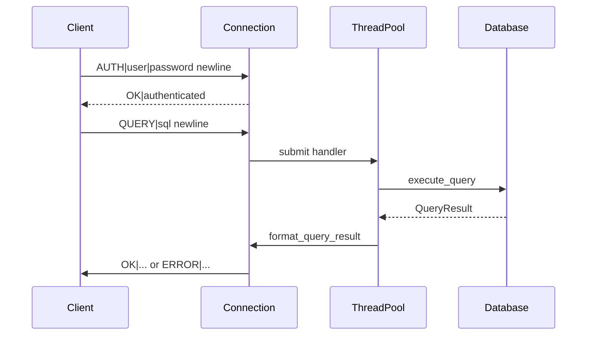

# NoBugDB

The world's first database with absolutely no bugs.

<small>
There are no bugs.

Only undocumented features.
</small>

**NoBugDB** (`nobugdb`) is a modular **C++17** SQL engine with a TCP server: parsing a subset of SQL, in-memory table operations, binary on-disk persistence, and client access via a simple text protocol.

---

## Table of contents

- [Features](#features)
- [Stack and dependencies](#stack-and-dependencies)
- [Project structure](#project-structure)
- [Build](#build)
- [Testing](#testing)
- [Running](#running)
- [Troubleshooting](#troubleshooting)
- [Network protocol](#network-protocol)
- [Persistence](#persistence)
- [Supported SQL](#supported-sql)
- [Architecture](#architecture)
- [Concurrency and performance](#concurrency-and-performance)
- [SQL examples](#sql-examples)
- [Logging and errors](#logging-and-errors)
- [Limitations and future work](#limitations-and-future-work)
- [Extending the codebase](#extending-the-codebase)
- [Statistics (approximate)](#statistics-approximate)
- [License and references](#license-and-references)

---

## Features

### Fully supported by the executor

- **CREATE TABLE** — schema with types and `PRIMARY KEY`, `UNIQUE`, `NOT NULL`, and table/column `CHECK (expression)` constraints.
- **CREATE VIEW** / **DROP VIEW** — named SELECT definitions; `SELECT`/`JOIN` against a view materializes its defining query (non-updatable in v1).
- **DROP TABLE** — removes the table from memory and deletes its `.db` file.
- **ALTER TABLE** — `ADD`/`DROP COLUMN`, `RENAME TO` / `RENAME COLUMN`, `ADD`/`DROP PRIMARY KEY`, `ADD`/`DROP UNIQUE (col)`, `ALTER COLUMN ... SET|DROP NOT NULL`, `ADD`/`DROP CHECK`.
- **INSERT** — one or many rows; explicit column list or table column order.
- **UPDATE** / **DELETE** — optional **WHERE**. **`UPDATE` `SET`** accepts only literals and column references on the right-hand side (no arithmetic).
- **EXPLAIN** — prefix any statement (`EXPLAIN SELECT ...`); the command is executed and a textual plan is returned in column `QUERY PLAN` (access path / join order for SELECT).
- **SELECT** — column list or `*`, optional **WHERE** (including **BETWEEN**), expressions in the SELECT list (arithmetic, qualified or unambiguous column references), **DISTINCT**, **GROUP BY**, **HAVING**, **ORDER BY** (ASC/DESC), **LIMIT**, **OFFSET**. **FROM** may name a single table **or** chain several tables with **JOIN**: **INNER** (including bare `JOIN`), **LEFT** / **RIGHT** / **FULL** with optional **OUTER**, and **CROSS**. **ON** is required for **LEFT**, **RIGHT**, and **FULL**; optional for **INNER** (without **ON**, the join is a Cartesian product); forbidden for **CROSS** (parse error if **ON** is present). With multiple tables, [`JoinSelectExecutor`](src/executor/join_select_executor.cc) runs nested-loop joins (equi-JOIN probes a B-tree on the right side when the join column is indexed); `SELECT *` emits **qualified** headers (`alias.column`). Bare column names must be unique across participating tables or execution reports an ambiguity error. Single-table queries still use [`SelectExecutor`](src/executor/query_executor.cc). After scan/join, [`SelectPipeline`](include/executor/select_pipeline.h) applies relational operators: [`GroupAggregateOperator`](include/executor/group_aggregate_operator.h) (grouping + aggregates + HAVING), [`DistinctOperator`](include/executor/distinct_operator.h), [`SortOperator`](include/executor/sort_operator.h), [`LimitOffsetOperator`](include/executor/limit_offset_operator.h). Expression evaluation shared via [`SelectExpressionEvaluator`](include/executor/select_expression_evaluator.h).
- **Indexes** — in-memory B-trees on **PRIMARY KEY** / **UNIQUE** columns; used for equality and range predicates in WHERE / UPDATE / DELETE and for INNER/LEFT equi-JOIN probes.
- Aggregate functions: **COUNT** (`*` or expression), **SUM**, **AVG**, **MIN**, **MAX** with **GROUP BY** or implicit single-group queries (`SELECT COUNT(*) FROM t`). Scalar functions in row expressions: **UPPER**, **LOWER**, **LENGTH**.
- **Types**: `INT`, `FLOAT`, `STRING`, `BOOLEAN`, `DATE`, `UUID` and synonyms from [`data_type.h`](include/types/data_type.h) (`INTEGER`, `REAL`, `TEXT`, `VARCHAR`, `BOOL`).
- **Persistence**: atomic per-table saves (write `.tmp` then rename); only dirty tables are flushed after mutations.
- **Network**: multi-client TCP server; **AUTH**, **QUERY**, **PING**, **QUIT** commands; optional file-based auth with `admin` / `reader` roles.
- **Client**: interactive mode and batch execution from a `.sql` file; optional `--user` / `--password` for AUTH.

### SELECT limitations (v1)

- **GROUP BY** validation: non-aggregate SELECT columns must match a **GROUP BY** expression; `SELECT *` is rejected with **GROUP BY** or bare aggregates.
- No window functions; aggregates run only with **GROUP BY** or a single implicit group.
- **ORDER BY** column position (`ORDER BY 1`) is not supported; use column names or expressions.
- **UPDATE** `SET` still evaluates only **literals** and **column references** on the right-hand side (no arithmetic in `SET`), via [`SelectExpressionEvaluator::evaluate_dml_assignment_rhs`](include/executor/select_expression_evaluator.h).

### C++ API

- **`Database::drop_table`** / SQL **`DROP TABLE`** both remove the table from memory and delete its persisted `.db` file.

---

## Stack and dependencies

| Component | Details |
|-----------|---------|
| Language | C++17 |
| Build | [Makefile](Makefile), `g++` |
| Platform | **Linux**, **macOS** (POSIX backend), **Windows** (MinGW-w64 / MSYS2, Winsock backend)—see [Build](#build) |
| Dependencies (server & client) | C++ standard library only for `bin/nobugdb` and `bin/nobugdb-cli` |
| Dependencies (tests) | Optional: [GoogleTest](https://github.com/google/googletest) via git submodule [`third_party/googletest`](third_party/googletest)—run `git submodule update --init --recursive` before `make test` |

Server entry point: [`main.cc`](main.cc). Defaults: port **9000**, workers **4**, data directory **`data`**, log level **INFO**. Override via CLI flags (see [Running](#running)).

---

## Project structure

```
nobugdb/               # repository root
├── include/
│   ├── core/          # Database, Table, Row, Column
│   ├── parser/        # Lexer, Parser, AST, Token
│   ├── executor/      # QueryExecutor, relational operators, SelectPipeline
│   ├── storage/       # PersistenceManager
│   ├── threading/     # ThreadPool, WorkQueue
│   ├── network/       # Server, Connection, Protocol
│   ├── platform/      # TcpSocket, ShutdownHandler, process helpers (OS abstraction)
│   ├── types/         # Value, DataType, TypeConverter
│   └── utils/         # Logger, Exceptions
├── src/               # Implementations (.cc), mirrors include/
│   └── platform/      # posix/ and win32/ backends + shared tcp_client.cc
├── tests/             # GoogleTest unit and integration tests
├── third_party/
│   └── googletest/    # git submodule (for `make test`)
├── client/
│   └── cli_client.cc  # TCP client
├── data/              # Table files (created at runtime)
├── main.cc
├── Makefile
└── README.md
```

---

## Build

### `make` targets

| Target | Action |
|--------|--------|
| `make` / `make all` / `make build` | Build server → `bin/nobugdb` |
| `make server` | Same, with a success message |
| `make client` | Build client → `bin/nobugdb-cli` |
| `make run` | Build and run the server |
| `make client-run` | Build and run the client (interactive) |
| `make demo` | Server in background, runs temporary SQL from `build/demo_queries.sql`, then stops server |
| `make tests` | Build test binary → `bin/run_tests` (requires initialized `third_party/googletest` submodule) |
| `make test` | Build and run `bin/run_tests` |
| `make clean` | Remove `build/` and `bin/` |
| `make data-clean` | Remove `data/` |
| `make distclean` | `clean` + `data-clean` |
| `make help` | Short help for targets |

Compiler flags: `-std=c++17 -Wall -Wextra -O2 -Iinclude`. The [Makefile](Makefile) selects the platform backend automatically (`posix` on Linux/macOS, `win32` when `OS=Windows_NT`).

### Supported platforms

| OS | Toolchain | Link flags | Notes |
|----|-----------|------------|-------|
| **Linux** | `g++`, `make` | `-pthread` | Primary CI/dev target |
| **macOS** | Xcode CLT or Homebrew `g++`, `make` | `-pthread` | Same POSIX backend as Linux |
| **Windows** | MSYS2 MinGW-w64 (`mingw-w64-x86_64-gcc`, `make`) | `-lws2_32` | Build from **MSYS2 MinGW** shell, not MSVC |

**Linux / macOS:**

```bash
make build
make client
make test
```

**Windows (MSYS2 MinGW 64-bit):**

```bash
pacman -S --needed mingw-w64-x86_64-gcc make
make build
make client
make test
```

`make help` prints the active backend (`posix` or `win32`). Test objects use extra include paths for GoogleTest.

---

## Testing

One-time setup if the submodule is empty:

```bash
git submodule update --init --recursive
```

Then:

```bash
make test
```

This compiles and runs `bin/run_tests`, which links the full server object set with GoogleTest. Coverage is organized by file under [`tests/`](tests/):

| Test source | Focus (high level) |
|-------------|--------------------|
| [`lexer_test.cc`](tests/lexer_test.cc) | Lexer tokens and edge cases; join keywords **FULL**, **OUTER**, **CROSS** |
| [`parser_test.cc`](tests/parser_test.cc) | Parser ↔ SQL statements |
| [`parser_ast_advanced_test.cc`](tests/parser_ast_advanced_test.cc) | Richer AST / parser scenarios; **CROSS** / **FULL OUTER** / **LEFT OUTER** join parsing |
| [`value_test.cc`](tests/value_test.cc) | `Value` type behavior |
| [`type_converter_test.cc`](tests/type_converter_test.cc) | Type conversion |
| [`row_test.cc`](tests/row_test.cc) | Row layout and access |
| [`ddl_test.cc`](tests/ddl_test.cc) | **DROP TABLE**, **ALTER TABLE**, **BETWEEN** parse |
| [`check_constraint_test.cc`](tests/check_constraint_test.cc) | **CHECK** on CREATE/ALTER, INSERT/UPDATE enforcement, NULL semantics, persist v5 |
| [`view_test.cc`](tests/view_test.cc) | **CREATE**/**DROP VIEW**, SELECT from view, JOIN views, name clash, nesting/cycles, persist reload, EXPLAIN `ViewScan` |
| [`persistence_test.cc`](tests/persistence_test.cc) | Atomic save, dirty-only flush, drop/rename files |
| [`btree_index_test.cc`](tests/btree_index_test.cc) | B-tree lookups, indexed SELECT / JOIN |
| [`cli_options_test.cc`](tests/cli_options_test.cc) | Server CLI flag parsing |
| [`database_test.cc`](tests/database_test.cc), [`database_extended_test.cc`](tests/database_extended_test.cc) | Database operations and persistence-oriented checks |
| [`select_join_test.cc`](tests/select_join_test.cc) | INNER / LEFT / RIGHT / FULL OUTER / CROSS joins, cartesian INNER without **ON**, chaining, parse errors, ambiguity, wildcard headers |
| [`select_relational_ops_test.cc`](tests/select_relational_ops_test.cc) | **GROUP BY**, **HAVING**, **ORDER BY**, **LIMIT**/**OFFSET**, **COUNT**/**SUM**/**AVG**/**MIN**/**MAX**, join + grouping |
| [`planner_test.cc`](tests/planner_test.cc) | Access path and join-order planner unit tests |
| [`explain_test.cc`](tests/explain_test.cc) | **EXPLAIN** parse, plan output, and side-effect execution |
| [`platform_tcp_socket_test.cc`](tests/platform_tcp_socket_test.cc) | Platform `TcpSocket` loopback send/recv |
| [`network_integration_test.cc`](tests/network_integration_test.cc) | TCP server + client-style exchange via [`tcp_exchange`](include/platform/tcp_client.h) |

Shared helpers live in [`tests/test_util.hh`](tests/test_util.hh).

---

## Running

**Terminal 1 — server:**

```bash
make run
# or:
./bin/nobugdb --port 9000 --workers 4 --data-dir data --log-level INFO
# flags: -p/--port, -w/--workers, -d/--data-dir, --log-level,
#         --auth-file, --require-auth, --no-require-auth, --bootstrap-admin, -h/--help
# listens on all interfaces (INADDR_ANY)
# stop: Ctrl+C (POSIX) or Ctrl+C / Ctrl+Break (Windows)
```

**Optional authentication:**

```bash
# Create users.conf with an admin account, then require AUTH before QUERY
./bin/nobugdb --data-dir data --auth-file data/users.conf --bootstrap-admin 'secret'

# Client with credentials (password may also come from NOBUGDB_PASSWORD)
./bin/nobugdb-cli --user admin --password secret
./bin/nobugdb-cli -u admin --password secret path/to/queries.sql
```

Users file format (`username:role:salt_hex:hash_hex`):

```
# role is admin or reader
# hash = SHA-256(salt_bytes || password_utf8) as hex; salt is 16 bytes
admin:admin:<32_hex_chars_salt>:<64_hex_chars_hash>
viewer:reader:<salt>:<hash>
```

- **`admin`**: all SQL.
- **`reader`**: SELECT, EXPLAIN of allowed statements, BEGIN/COMMIT/ROLLBACK, PREPARE/EXECUTE of read-only SQL; writers and DDL denied.
- Without `--auth-file`, auth is off (open QUERY, as before). With `--auth-file`, `--require-auth` defaults to on unless `--no-require-auth`.
- Passwords are never logged (AUTH payloads are redacted). This is a simple teaching/demo auth layer — **not production-hardened** (no TLS, no rate limiting, SHA-256 of salt+password only).

**Terminal 2 — client:**

```bash
make client-run
```

Batch mode:

```bash
./bin/nobugdb-cli path/to/queries.sql
```

Lines starting with `#` and empty lines are ignored. A statement is assembled until a line ends with `;`.

---

## Troubleshooting

| Symptom | Likely cause |
|---------|----------------|
| `Failed to bind socket` | Port in use or previous server still holding it—pass `--port` / `-p` or free the port (`SO_REUSEADDR` is already enabled). |
| Client: `Connection failed` | Server not running, or wrong host/port in `cli_client.cc` (defaults: `127.0.0.1:9000`). |
| Empty or truncated response | Query or result larger than the receive buffer—see [Network protocol](#network-protocol). |
| Data missing after `Ctrl+C` | Saves run after successful **INSERT**/**UPDATE**/**DELETE**/**CREATE TABLE**; abrupt termination may leave files at the last successful save only. |
| Compile errors | Need a **C++17** compiler (`g++` 8+). On Windows use the **MinGW** MSYS2 environment, not plain `cmd` without `g++`. |
| Windows: link errors mentioning `socket` / `WSAStartup` | Build with the project Makefile (adds `-lws2_32`); ensure `TcpSocket::startup()` ran (server/client call it on start). |
| Windows: `make demo` fails | Demo uses shell-specific process control; run server and client manually in two terminals if needed. |

---

## Network protocol

Client messages are UTF-8 lines terminated by `\n`. Server-side parsing: [`Protocol::parse_request`](include/network/protocol.h).

### Requests

| Kind | Format | Action |
|------|--------|--------|
| Auth | **AUTH** + `\|` + username + `\|` + password + `\n` | Verify credentials; response `OK|authenticated\n` or `ERROR|...` |
| SQL | Line built like the CLI: protocol verb **QUERY**, a delimiter ASCII `\|` (U+007C), the SQL text, then LF `\n` | Run SQL via [`Database::execute_query`](src/core/database.cc) (requires prior AUTH when `--require-auth`) |
| Health check | **PING** + `\|` + payload + `\n` — delimiter required (`Protocol::parse_request`) | Response `PONG\n` (allowed without AUTH) |
| Quit | **QUIT** + `\|` + payload + `\n` | Response `OK|Goodbye\n`, session ends (allowed without AUTH) |

Unauthenticated connections (when auth is required) may only send **AUTH**, **PING**, and **QUIT**. [`cli_client.cc`](client/cli_client.cc) sends **AUTH** when `--user` / `--password` are set, then **QUERY**.

### Responses

- Success: prefix **`OK|`**, then newline; first line is column names separated by **tab** `\t`; following lines are result rows, fields separated by `\t`. Implementation: [`Protocol::format_response`](src/network/protocol.cc). Auth success is `OK|authenticated\n`.
- Error: **`ERROR|<text>\n`** (e.g. `authentication required`, `permission denied`).

Limitation: a single read is capped at **4096** bytes on the server ([`Connection::read_message`](src/network/server.cc)) and **8192** bytes on the client when receiving—large queries or wide results need protocol changes (framing / length prefix).

### QUERY execution flow



---

## Persistence

- Default directory: **`data/`** (CLI `--data-dir` / `Server` constructor).
- On startup: [`Database::load_from_disk`](src/core/database.cc) → [`PersistenceManager::load_database`](include/storage/persistence_manager.h).
- After successful mutations (**INSERT** / **UPDATE** / **DELETE** / **CREATE** / **ALTER**): only **dirty** tables are saved via atomic write (`.tmp` then rename) — [`persist_dirty_tables`](src/core/database.cc).
- **DROP TABLE** deletes the corresponding `.db` file immediately.
- File format: magic **`0x44425442`** (`"DBTB"`), version **4** ([`PersistenceManager`](include/storage/persistence_manager.h)); older v1–v3 files are still readable.

---

## Supported SQL

### DDL

- **`CREATE TABLE`** — column definitions with types and modifiers; table-level and column-level `CHECK (expression)` (no subqueries/aggregates in v1; NULL makes the predicate UNKNOWN and the row is accepted).
- **`CREATE VIEW name AS <select>`** — stores the SELECT text; name must not collide with a table (and vice versa).
- **`DROP VIEW [IF EXISTS] name`**
- **`DROP TABLE`**
- **`ALTER TABLE`** — `ADD`/`DROP COLUMN`, `RENAME TO` / `RENAME COLUMN`, primary key / unique / not-null constraint changes, `ADD [CONSTRAINT name] CHECK (...)` / `DROP CHECK name`.

### DML

- **`INSERT INTO`** — `VALUES` for one or more rows.
- **`SELECT`** — see [Features](#features): single table or **JOIN** chains, **WHERE** (incl. **BETWEEN**), **DISTINCT**, **GROUP BY**, **HAVING**, **ORDER BY**, **LIMIT**, **OFFSET**, aggregates and scalar functions.
- **`UPDATE`** / **`DELETE`** — optional **WHERE**.
- **`EXPLAIN`** — run any statement and return its plan as a `QUERY PLAN` result set.

### Expressions in WHERE and SELECT

Comparisons, logical **AND** / **OR**, **NOT**, arithmetic `+ - * / %`, parentheses via the AST. Column identifiers and literals follow the parser rules.

---

## Architecture

### Layers

1. **Client** — TCP connect, protocol lines, pretty-print (tabs shown as spaces).
2. **Network** — `accept` thread; per-client read thread [`Connection`](src/network/server.cc); work submitted to **`ThreadPool`**; implementation waits for each task before reading the next message on the same socket.
3. **Parser** — [`Lexer`](src/parser/lexer.cc) → [`Parser`](src/parser/parser.cc) → AST ([`ast.h`](include/parser/ast.h)).
4. **Routing** — [`Database::execute_query`](src/core/database.cc) dispatches by statement type to `execute_select_statement`, `execute_insert_statement`, etc.
5. **Execution** — [`QueryExecutor`](include/executor/query_executor.h) classes: `SelectExecutor`, `JoinSelectExecutor`, `InsertExecutor`, `UpdateExecutor`, `DeleteExecutor`, `CreateTableExecutor`; shared [`SelectExpressionEvaluator`](include/executor/select_expression_evaluator.h) for row/column binding in SELECT and DML predicates.
6. **SELECT post-processing** — [`SelectPipeline`](src/executor/select_pipeline.cc) chains [`IRelationalOperator`](include/executor/relational_operator.h) implementations after scan/join: group/aggregate → distinct → sort → limit/offset (see [`select_analysis.h`](include/executor/select_analysis.h) for grouping rules).
7. **Storage** — [`Table`](include/core/table.h) / [`Row`](include/core/row.h) / [`Column`](include/core/column.h); serialization via `PersistenceManager`.


### Patterns (conservative wording)

- **Strategy-like** split: separate executor classes sharing `QueryExecutor`; SELECT post-steps use **`IRelationalOperator`** (Open/Closed for new operators).
- **Singleton**: [`Logger`](include/utils/logger.h) only (`Logger::get_instance()`).
- **`Database`** is **not** a singleton: one instance per **`Server`**, passed into connections by pointer.
- Session teardown: `std::function` callback to unregister the connection ([`schedule_unregister_connection`](src/network/server.cc)).

---

## Concurrency and performance

- All **`Database::execute_query`** calls run under **`std::recursive_mutex`** ([`db_mutex_`](include/core/database.h)). Despite the thread pool, database work is **serialized**—no cross-client parallelism at the DB layer.
- **`ThreadPool`** is infrastructure for future work; the bottleneck today is one global lock for parse + execute.
- Typical cost: full table scan **O(n)** when no useful index; point/range lookups on PK/UNIQUE are **O(log n + k)** via B-tree; each **JOIN** is nested-loop (**O(n·m)** without an equi-probe index on the right side).

See [Limitations and future work](#limitations-and-future-work) for more.

---

## SQL examples

### Table and inserts

```sql
CREATE TABLE users (
  id INT PRIMARY KEY,
  name STRING NOT NULL,
  age INT,
  active BOOLEAN
);

INSERT INTO users (id, name, age, active)
VALUES (1, 'Alice', 30, true);

INSERT INTO users VALUES (2, 'Bob', 25, true);
```

### Views

```sql
CREATE VIEW adults AS SELECT id, name, age FROM users WHERE age >= 18;

SELECT * FROM adults;

DROP VIEW adults;
-- DROP VIEW IF EXISTS adults;
```

### Queries (reliable scenarios)

```sql
SELECT * FROM users;

SELECT name, age FROM users WHERE age > 25;

SELECT DISTINCT age FROM users;

SELECT name FROM users WHERE active = true AND age >= 30;

SELECT age FROM users ORDER BY age DESC LIMIT 5 OFFSET 0;
```

### Aggregation and grouping

```sql
CREATE TABLE sales (id INT PRIMARY KEY, dept STRING, amount INT);
INSERT INTO sales VALUES (1, 'A', 10), (2, 'A', 20), (3, 'B', 5);

SELECT dept, COUNT(*), SUM(amount), AVG(amount)
FROM sales
GROUP BY dept
HAVING COUNT(*) > 1
ORDER BY dept;

SELECT COUNT(*) FROM sales;
```

### Joins

```sql
CREATE TABLE orders (id INT PRIMARY KEY, user_id INT NOT NULL);
CREATE TABLE customers (id INT PRIMARY KEY, name STRING NOT NULL);
INSERT INTO orders VALUES (1, 10);
INSERT INTO customers VALUES (10, 'Carol');

SELECT orders.id, customers.name
FROM orders
INNER JOIN customers ON orders.user_id = customers.id;

-- Cartesian product (INNER without ON, or CROSS)
SELECT a.i, b.j FROM a INNER JOIN b;
SELECT a.i, b.j FROM a CROSS JOIN b;

-- FULL OUTER (unmatched rows from either side appear with NULLs)
SELECT fa.id, fb.id
FROM fa FULL OUTER JOIN fb ON fa.id = fb.id;
```

### Update and delete

```sql
UPDATE users SET age = 31 WHERE id = 1;

DELETE FROM users WHERE id = 2;
```

### Explain

```sql
EXPLAIN SELECT * FROM users WHERE id = 1;
EXPLAIN INSERT INTO users VALUES (3, 'Eve', 22, true);
```

There is still no **`table.\*`** qualifier (only `*` or qualified column names; multi-table `SELECT *` uses `alias.column` headers). See [SELECT limitations (v1)](#select-limitations-v1) for grouping and **ORDER BY** constraints.

---

## Logging and errors

Macros from [`logger.h`](include/utils/logger.h):

```cpp
DB_LOG_DEBUG("...");
DB_LOG_INFO("...");
DB_LOG_WARNING("...");
DB_LOG_ERROR("...");
```

Exception hierarchy in [`exceptions.h`](include/utils/exceptions.h):

| Type | Purpose |
|------|---------|
| `ParseException` | SQL parse errors |
| `ConstraintException` | Constraint violations |
| `NotFoundException` | Missing table or column |
| `TypeException` | Type errors |
| `InvalidOperationException` | Invalid operation |
| `StorageException` | Persistence I/O errors |
| `NetworkException` | Socket errors on the server |

At the network boundary many failures become **`ERROR|...`** text rather than C++ exceptions on the client.

---

## Limitations and future work

### Current limitations

- In-memory heap storage: no disk page model, buffer pool, or page locks.
- Auth is optional file-based TCP AUTH (SHA-256 of salt+password); no TLS, no per-table GRANT, not production-hardened.
- Cost-based planning is pragmatic (no histograms / hash-join).
- Request/response size bounded by fixed receive buffers.

### Possible enhancements

Step-by-step implementation plans (P0–P3): **[docs/plans/README.md](docs/plans/README.md)** (CHECK, views, auth, set ops, windows, hash join, functions/procedures, pages, partitions, backup, triggers, sharding).

1. Connection pooling and framed/streaming protocol for large payloads.
2. Window functions and richer **ORDER BY** (column ordinals).
3. Backup and recovery tooling.
4. Prepared-plan reuse beyond AST cache; richer statistics.
5. Hash joins and fuller join reordering for outer joins.

---

## Extending the codebase

1. **New SQL statement** — extend [`Parser`](src/parser/parser.cc), add a `parse_statement` variant, handle it in `Database::execute_query`.
2. **New data type** — [`Value`](include/types/value.h), [`DataType`](include/types/data_type.h), [`TypeConverter`](include/types/type_converter.h), checks in [`Table`](src/core/table.cc).
3. **New constraint** — [`Column`](include/core/column.h) + INSERT/UPDATE validation.
4. **New relational operator** — implement [`IRelationalOperator`](include/executor/relational_operator.h) and register it in [`SelectPipeline`](src/executor/select_pipeline.cc) (existing examples: [`GroupAggregateOperator`](src/executor/group_aggregate_operator.cc), [`SortOperator`](src/executor/sort_operator.cc)).

For regression, run **`make test`** after pulling submodules; use the client and **`make demo`** for manual end-to-end checks.

---

## Statistics (approximate)

| Metric | Value |
|--------|-------|
| Headers + sources under `include/` + `src/` | **~50** files (`.h` / `.cc`) |
| Lines in `src/**/*.cc` + `main.cc` | **~5000** (version-dependent) |
| Test sources | **12** `tests/*.cc` + [`test_util.hh`](tests/test_util.hh); **~1100** lines in test `.cc` files (approx.) |
| Major subsystems | network, parser, executor, storage, types, threading |

---

## License and references

**NoBugDB** — standalone SQL engine focused on a clear client/server execution path and extensible internals. There are no bugs. Only undocumented features.

Useful references:

- SQL standard (ISO/IEC 9075)—conceptual background.
- C++17 and standard library documentation.
- Berkeley sockets / Winsock2 (abstracted in [`include/platform/`](include/platform/)).
- Database textbooks (e.g. Silberschatz, Korth, Sudarshan—*Database System Concepts*).

**Build:** `g++`, C++17, `-Iinclude`. **Targets:** Linux, macOS (POSIX backend), Windows MinGW-w64 (Winsock backend).
