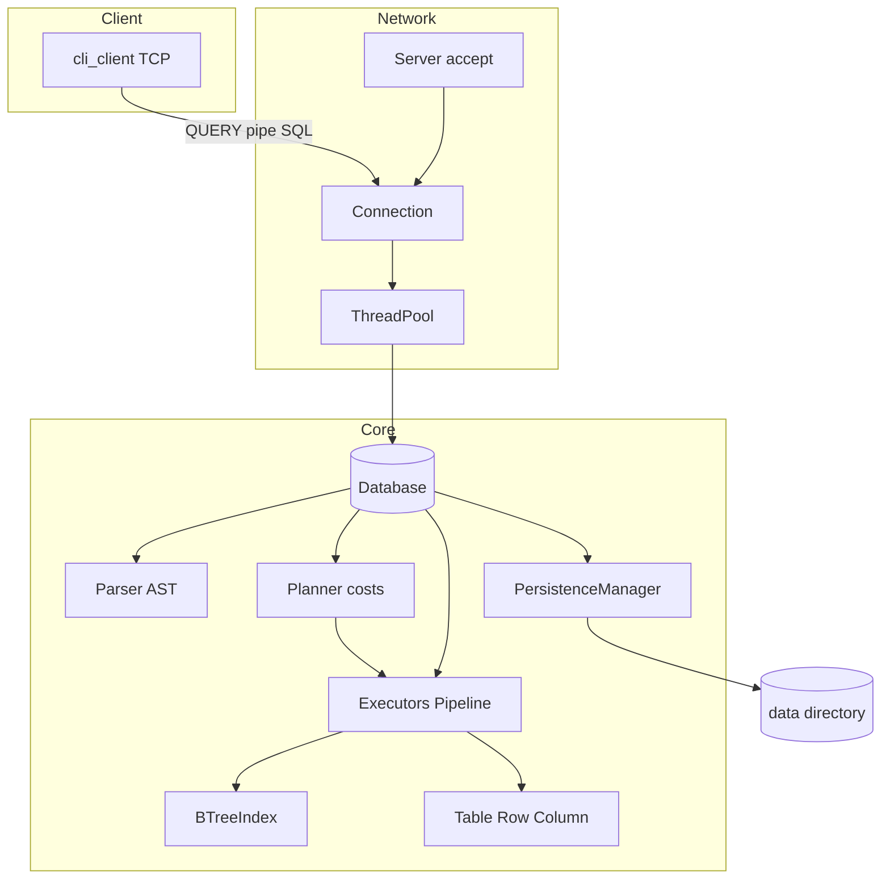

# How NoBugDB is structured

## Purpose

**NoBugDB** is a SQL engine with a TCP server, **fixed-size page heap**, **buffer pool**, and atomic table writes to disk: **client → network → SQL parse → execute → persist**. Dependencies are limited to the **C++ standard library** and platform sockets (POSIX / Winsock). Optional file-based TCP authentication (`AUTH`) with roles `admin` / `reader` is available via `--auth-file`.

Server entry point: [`main.cc`](../main.cc) (`nobugdb`) — CLI parsing (`--port`, `--workers`, `--data-dir`, `--buffer-pool-pages`, `--auth-file`, `--require-auth`, `--bootstrap-admin`, `--log-level`), then [`Server`](../include/network/server.h) and `start()` / `wait()`. Client binary: `nobugdb-cli` (`--user` / `--password`).

## Main layers (bottom-up)

| Layer | Role | Key files |
|-------|------|-----------|
| **Types and values** | `Value`, `DataType`, conversions | [`include/types/`](../include/types/) |
| **Data model** | `Table` facade over `HeapFile`, `Row`, `Column`, B-tree indexes on PK/UNIQUE; optional `PartitionedTableMetadata` | [`include/core/`](../include/core/), [`partition.h`](../include/core/partition.h) |
| **Parsing** | Lexer → tokens → Parser → AST | [`src/parser/`](../src/parser/) |
| **Planner** | Cost model, access path, join order | [`include/planner/`](../include/planner/) |
| **Execution** | SELECT / DML / DDL executors + `SelectPipeline` | [`include/executor/`](../include/executor/) |
| **Storage** | Pages (8 KiB), `BufferPool` (clock), `HeapFile`, persistence | [`include/storage/`](../include/storage/) |
| **Persistence** | Atomic save of dirty tables under `data/` (format v6) | [`persistence_manager.h`](../include/storage/persistence_manager.h) |
| **Network** | TCP accept, thread pool | [`src/network/`](../src/network/) |
| **Client** | TCP CLI | [`client/cli_client.cc`](../client/cli_client.cc) |

## SQL execution flow

1. Client may send **`AUTH|<user>|<password>\n`** (when `--auth-file` / `--require-auth`).
2. Client sends **`QUERY|<SQL>\n`**.
3. [`Connection`](../src/network/server.cc) rejects QUERY if auth is required and the session is not authenticated; otherwise submits the task to [`ThreadPool`](../include/threading/thread_pool.h).
4. [`Database::execute_query`](../src/core/database.cc):
   - **Parser** builds the AST;
   - if the session is authenticated, [`can_execute`](../include/core/authorization.h) enforces `admin` / `reader`;
   - by statement type, SELECT / INSERT / UPDATE / DELETE / CREATE / **DROP** / **ALTER** / **VACUUM** is invoked;
   - after successful mutations — **`persist_dirty_tables`**: only dirty tables are saved via temp+rename.
5. Response: `OK|...` or `ERROR|...`.

## Authentication

- [`AuthManager`](../include/core/auth_manager.h): loads `username:role:salt_hex:hash_hex` (SHA-256 of salt‖password).
- [`SessionContext`](../include/core/session_context.h): `authenticated`, `username`, `role`.
- Roles: `admin` (all SQL), `reader` (SELECT / EXPLAIN of allowed stmts / TX control / read-only PREPARE·EXECUTE).
- Not production-hardened (no TLS).

## SELECT pipeline

- Single-table SELECT: [`SelectExecutor`](../src/executor/query_executor.cc) — [`AccessPathChooser`](../include/planner/access_path_chooser.h) chooses IndexScan vs SeqScan by cost; sargable WHERE → B-tree, otherwise full scan; then [`SelectPipeline`](../include/executor/select_pipeline.h).
- Multiple tables: [`JoinSelectExecutor`](../src/executor/join_select_executor.cc) — for 2-table INNER equi, [`JoinMethodChooser`](../include/planner/join_method_chooser.h) picks HashJoin / IndexNestedLoop / NestedLoop using [`TableStatistics`](../include/planner/table_statistics.h); [`JoinOrderPlanner`](../include/planner/join_order_planner.h) for order; outer/non-equi remain nested-loop (B-tree probe when indexed).
- Supported: JOIN (INNER/LEFT/RIGHT/FULL/CROSS), GROUP BY, HAVING, ORDER BY, LIMIT/OFFSET, DISTINCT, aggregates, window functions (`ROW_NUMBER` / `RANK` / `DENSE_RANK` / running `SUM` / `AVG` with `OVER`).
- Window stage: [`WindowOperator`](../include/executor/window_operator.h) after grouping, before DISTINCT. Running aggregates use a **ROWS** frame (UNBOUNDED PRECEDING … CURRENT ROW) within each partition after `ORDER BY`. `OVER` requires `ORDER BY` in v1. Partition/order expressions resolve against projected result column names.
- Predicates: `EXISTS` / `NOT EXISTS`, `IN` / `NOT IN` (literal list or subquery), scalar subquery.

## DDL

| Statement | Behavior |
|-----------|----------|
| `DROP TABLE` | Remove from catalog + `remove_table_file` |
| `ALTER TABLE ... ADD/DROP COLUMN` | Schema + backfill NULL / remove values |
| `RENAME TO` / `RENAME COLUMN` | Rename + `.db` file on table rename |
| `ADD/DROP PRIMARY KEY`, `UNIQUE`, `SET/DROP NOT NULL` | Column flags + index rebuild |
| Column `DEFAULT` | Default value on INSERT (omitted columns) |
| `ADD/DROP CHECK` | Table CHECK predicates; enforced on INSERT/UPDATE |
| `CREATE VIEW` / `DROP VIEW` | Named SELECT; non-updatable; persisted under `_views/` |
| `CREATE FUNCTION` / `DROP FUNCTION` | Scalar SQL UDF; persisted under `_routines/*.func` |
| `CREATE PROCEDURE` / `DROP PROCEDURE` / `CALL` | Statement-list body in `$$`; persisted under `_routines/*.proc` |
| `CREATE TRIGGER` / `DROP TRIGGER` | Row-level BEFORE/AFTER INSERT/UPDATE/DELETE; persisted under `_triggers/*.trig` |

## Views

- [`ViewDefinition`](../include/core/view_definition.h) / [`ViewCatalog`](../include/core/view_catalog.h): name → SELECT SQL text (+ cached AST).
- [`ViewExpander`](../include/core/view_expander.h): on `SELECT`, materializes each view in `FROM`/`JOIN` into an ephemeral `Table`, preserves the user alias; nested views allowed with cycle detection and depth limit (`MAX_VIEW_NESTING_DEPTH = 8`).
- Persistence: `{data_dir}/_views/{name}.view` (SQL text only); re-parsed on `load_from_disk`.
- `EXPLAIN` annotates `ViewScan(name)` before the usual access-path lines.
- v1: not updatable (INSERT/UPDATE/DELETE on a view name fail as table-not-found).

## Functions and procedures

- [`IScalarFunction`](../include/executor/scalar_function.h) / [`ScalarFunctionRegistry`](../include/executor/scalar_function.h): builtins (`upper`, `lower`, `length`, `coalesce`, `nullif`, `substring`/`substr`, `current_date`); `CAST` is a dedicated [`CastExpression`](../include/parser/ast.h).
- [`RoutineCatalog`](../include/core/routine_catalog.h): functions (`*.func`) and procedures (`*.proc`) under `{data_dir}/_routines/`; full CREATE SQL text persisted (including `$$` bodies); loaded on `Database::load_from_disk`.
- UDF evaluation: after builtins, bind IN params as locals on [`SelectExpressionEvaluator`](../include/executor/select_expression_evaluator.h) and evaluate the body expression.
- [`ProcedureExecutor`](../include/executor/procedure_executor.h): `CALL` binds args → locals, re-parses each body statement, `dispatch_statement` sequentially; stops on first error (open TX left to caller `ROLLBACK`).
- Auth: CREATE/DROP routine — `admin` only; CALL denied for `reader` in v1.

## Triggers

- [`TriggerDefinition`](../include/core/trigger.h) / [`TriggerCatalog`](../include/core/trigger.h): name → table, timing (`Before`/`After`), event (`Insert`/`Update`/`Delete`), statement list; order is registration order.
- Persistence: `{data_dir}/_triggers/{name}.trig` (full CREATE SQL); loaded on `Database::load_from_disk`.
- [`TriggerExecutor`](../include/executor/trigger_executor.h): BEFORE → mutate → AFTER around each row in INSERT/UPDATE/DELETE (also partitioned DML and FK CASCADE/SET NULL).
- `NEW` / `OLD` bound via [`CorrelationContext`](../include/core/correlation_context.h); BEFORE INSERT/UPDATE may run `SET NEW.col = expr`.
- Recursion depth limited to `MAX_TRIGGER_DEPTH` (16); work runs in the same transaction (ROLLBACK undoes side effects).
- MVCC: BEFORE sees the pending row image; AFTER sees the post-mutation state of the current statement/TX.
- Auth: CREATE/DROP TRIGGER — `admin` only (not allowed for `reader`).

## Indexes

- [`BTreeIndex`](../include/core/btree_index.h) on [`IndexKey`](../include/core/index_key.h): **PRIMARY KEY**, **UNIQUE**, and secondary (`CREATE INDEX name ON table(col1, col2, ...)`).
- Composite secondary indexes: equality/prefix lookup on leftmost columns.
- Predicate extraction: [`index_predicate.h`](../include/executor/index_predicate.h).
- Equality and range are supported; `BETWEEN` is desugared to `>= AND <=` at parse time.

## Foreign keys

- [`ForeignKeyDefinition`](../include/core/foreign_key.h): single- and **multi-column** FKs; `ON DELETE` / `ON UPDATE`: `RESTRICT`, `CASCADE`, `SET NULL`, `SET DEFAULT`.
- Parent key: PK/UNIQUE (single column) or a secondary index covering the parent columns.
- Enforced on INSERT/UPDATE/DELETE; CASCADE is recursive with cycle protection.

## CHECK constraints

- [`CheckConstraintDefinition`](../include/core/check_constraint.h): named (or auto `ck_N`) boolean expression on the table.
- Parsed on `CREATE TABLE` (table-level or column-level sugar) and `ALTER TABLE ... ADD/DROP CHECK`.
- Enforced in [`Table::validate_row`](../include/core/table.h) via `SelectExpressionEvaluator::evaluate_check_condition` (SQL three-valued logic: UNKNOWN passes).
- v1 rejects subqueries and aggregates inside CHECK.

## Subqueries and PREPARE

- Scalar / `IN` / `EXISTS`: uncorrelated and **correlated** ([`CorrelationContext`](../include/core/correlation_context.h)).
- `PREPARE` / `EXECUTE` with positional `?` or `$1..$n` (no mixing in one statement) via [`BindContext`](../include/core/bind_context.h).

## Transactions, locks, vacuum

- `BEGIN` / `COMMIT` / `ROLLBACK` on [`SessionContext`](../include/core/session_context.h).
- **MVCC / snapshot isolation**: `xmin`/`xmax`, snapshot taken at BEGIN (registered in [`TransactionManager`](../include/core/transaction_manager.h)).
- Writers: **row Exclusive** on UPDATE/DELETE (`table:#rowIndex`); INSERT/DDL — table Exclusive; deadlock detection ([`LockManager`](../include/core/lock_manager.h)).
- Version GC: horizon = min `snapshot.xmax` of active readers; vacuum on COMMIT/ROLLBACK, SQL `VACUUM`, and a background worker (configurable interval, `0` = sync only).
- [`WalManager`](../include/storage/wal_manager.h): dirty-table blobs → `COMMIT` → rename `.db` → truncate WAL.
  - **WAL v1 semantics:** still a logical full-table image (entire `.db` file bytes), not page-diff WAL.
- [`Database::checkpoint()`](../include/core/database.h): flush dirty tables via the same WAL path, buffer-pool sync, truncate WAL when safe.
- Offline backup/restore: [`BackupService`](../include/storage/backup_service.h) checkpoints, copies the entire data dir, writes `backup_manifest` (SHA-256 per file); CLI `bin/db_backup` / `make backup` / `make restore`. Hot backup and PITR are out of scope for v1.

## Persistence

- `.db` format **v6**: schema header (columns, indexes, FKs, CHECKs as in v5) then `page_count` + contiguous **8192-byte** heap pages. v1–v5 row-blob files remain readable and rewrite as v6 on next save.
- Runtime path: `Table` → `HeapFile` → `IBufferPool` → `IPageStore` (memory or file). Logical row ids stay `size_t` via an `ItemPointer` directory; indexes unchanged.
- `Database` owns a shared [`BufferPool`](../include/storage/buffer_pool.h) (CLI `--buffer-pool-pages`, default 64); dirty frames flushed on persist / shutdown.
- `save_table`: flush heap pages → `{name}.db.tmp` → rename.
- Views: `{data_dir}/_views/{name}.view` (defining SELECT text).
- Routines: `{data_dir}/_routines/{name}.func|.proc`.
- Triggers: `{data_dir}/_triggers/{name}.trig`.
- Partition metadata: `{data_dir}/_partitions/{parent}.part` (strategy, key column, child bounds). Parent is catalog-only; children are ordinary `.db` heaps. INSERT routes via `IPartitionRouter`; SELECT applies partition pruning (`PartitionPrune` in EXPLAIN).
- Builtin sharding: static [`ShardMap`](../include/core/shard_map.h) + [`ShardRouter`](../include/core/shard_router.h); coordinator [`CoordinatorQueryRouter`](../include/network/coordinator_query_router.h) proxies or scatter-gathers via `RPC_QUERY` ([`IRpcClient`](../include/network/rpc_client.h)). Workers keep the normal `Database` engine.
- After a mutation (outside a TX) — only dirty tables via WAL.

## Concurrency

- Thread pool; catalog guarded by `recursive_mutex`.
- Locks are acquired **before** the catalog mutex.
- SELECT without Shared locks (visibility snapshot).

## Limitations

- No page locks / tablespaces / compression; rows must fit in a single page.
- Optional TCP AUTH only (file-based roles); no TLS / fine-grained GRANT.
- Cost model uses row counts, NDV, and equal-width histograms; hash join is INNER equi only.
- Request/response limited by fixed receive buffers.
- Partitioning v1: RANGE/HASH only; no SUBPARTITION, global indexes, or FK on partitioned parents.
- Sharding v1: static map; no distributed TX, cross-shard JOIN, Raft, or auto-rebalance.

See [README](../README.md) for more detail.

---

## Visualization

