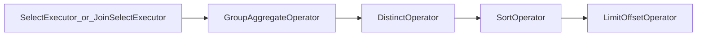
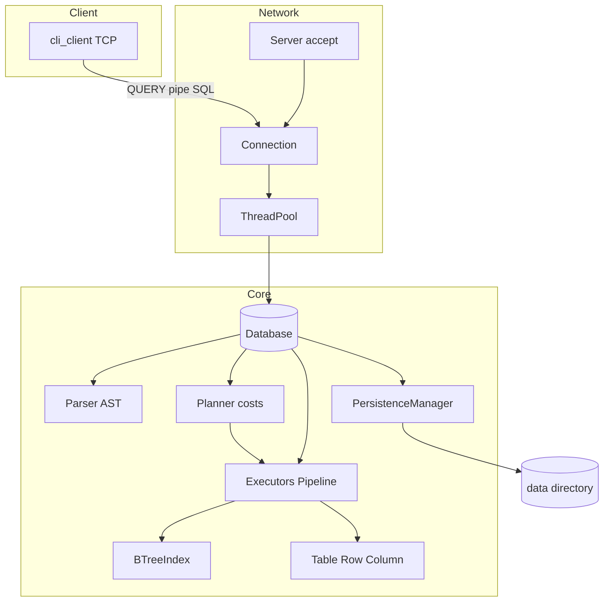

# How NoBugDB is structured

## Purpose

**NoBugDB** is an in-memory SQL engine with a TCP server and atomic table writes to disk: **client → network → SQL parse → execute → persist**. Dependencies are limited to the **C++ standard library** and platform sockets (POSIX / Winsock). Optional file-based TCP authentication (`AUTH`) with roles `admin` / `reader` is available via `--auth-file`; there is no page-oriented buffer pool — storage remains heap + `.db` files.

Server entry point: [`main.cc`](../main.cc) (`nobugdb`) — CLI parsing (`--port`, `--workers`, `--data-dir`, `--auth-file`, `--require-auth`, `--bootstrap-admin`, `--log-level`), then [`Server`](../include/network/server.h) and `start()` / `wait()`. Client binary: `nobugdb-cli` (`--user` / `--password`).

## Main layers (bottom-up)

| Layer | Role | Key files |
|-------|------|-----------|
| **Types and values** | `Value`, `DataType`, conversions | [`include/types/`](../include/types/) |
| **Data model** | `Table`, `Row`, `Column`, B-tree indexes on PK/UNIQUE | [`include/core/`](../include/core/), [`btree_index.h`](../include/core/btree_index.h) |
| **Parsing** | Lexer → tokens → Parser → AST | [`src/parser/`](../src/parser/) |
| **Planner** | Cost model, access path, join order | [`include/planner/`](../include/planner/) |
| **Execution** | SELECT / DML / DDL executors + `SelectPipeline` | [`include/executor/`](../include/executor/) |
| **Persistence** | Atomic save of dirty tables under `data/` | [`persistence_manager.h`](../include/storage/persistence_manager.h) |
| **Network** | TCP accept, thread pool | [`src/network/`](../src/network/) |
| **Client** | TCP CLI | [`client/cli_client.cc`](../client/cli_client.cc) |

## SQL execution flow

1. Client may send **`AUTH|<user>|<password>\n`** (when `--auth-file` / `--require-auth`).
2. Client sends **`QUERY|<SQL>\n`**.
3. [`Connection`](../src/network/server.cc) rejects QUERY if auth is required and the session is not authenticated; otherwise submits the task to [`ThreadPool`](../include/threading/thread_pool.h).
4. [`Database::execute_query`](../src/core/database.cc):
   - **Parser** builds the AST;
   - if the session is authenticated, [`can_execute`](../include/core/authorization.h) enforces `admin` / `reader`;
   - by statement type, SELECT / INSERT / UPDATE / DELETE / CREATE / **DROP** / **ALTER** / **VACUUM** is invoked;
   - after successful mutations — **`persist_dirty_tables`**: only dirty tables are saved via temp+rename.
5. Response: `OK|...` or `ERROR|...`.

## Authentication

- [`AuthManager`](../include/core/auth_manager.h): loads `username:role:salt_hex:hash_hex` (SHA-256 of salt‖password).
- [`SessionContext`](../include/core/session_context.h): `authenticated`, `username`, `role`.
- Roles: `admin` (all SQL), `reader` (SELECT / EXPLAIN of allowed stmts / TX control / read-only PREPARE·EXECUTE).
- Not production-hardened (no TLS).

## SELECT pipeline

- Single-table SELECT: [`SelectExecutor`](../src/executor/query_executor.cc) — [`AccessPathChooser`](../include/planner/access_path_chooser.h) chooses IndexScan vs SeqScan by cost; sargable WHERE → B-tree, otherwise full scan; then [`SelectPipeline`](../include/executor/select_pipeline.h).
- Multiple tables: [`JoinSelectExecutor`](../src/executor/join_select_executor.cc) — nested-loop; for 2-table INNER — [`JoinOrderPlanner`](../include/planner/join_order_planner.h); equi-join probe via B-tree.
- Supported: JOIN (INNER/LEFT/RIGHT/FULL/CROSS), GROUP BY, HAVING, ORDER BY, LIMIT/OFFSET, DISTINCT, aggregates.
- Predicates: `EXISTS` / `NOT EXISTS`, `IN` / `NOT IN` (literal list or subquery), scalar subquery.

## DDL

| Statement | Behavior |
|-----------|----------|
| `DROP TABLE` | Remove from catalog + `remove_table_file` |
| `ALTER TABLE ... ADD/DROP COLUMN` | Schema + backfill NULL / remove values |
| `RENAME TO` / `RENAME COLUMN` | Rename + `.db` file on table rename |
| `ADD/DROP PRIMARY KEY`, `UNIQUE`, `SET/DROP NOT NULL` | Column flags + index rebuild |
| Column `DEFAULT` | Default value on INSERT (omitted columns) |
| `ADD/DROP CHECK` | Table CHECK predicates; enforced on INSERT/UPDATE |
| `CREATE VIEW` / `DROP VIEW` | Named SELECT; non-updatable; persisted under `_views/` |

## Views

- [`ViewDefinition`](../include/core/view_definition.h) / [`ViewCatalog`](../include/core/view_catalog.h): name → SELECT SQL text (+ cached AST).
- [`ViewExpander`](../include/core/view_expander.h): on `SELECT`, materializes each view in `FROM`/`JOIN` into an ephemeral `Table`, preserves the user alias; nested views allowed with cycle detection and depth limit (`MAX_VIEW_NESTING_DEPTH = 8`).
- Persistence: `{data_dir}/_views/{name}.view` (SQL text only); re-parsed on `load_from_disk`.
- `EXPLAIN` annotates `ViewScan(name)` before the usual access-path lines.
- v1: not updatable (INSERT/UPDATE/DELETE on a view name fail as table-not-found).

## Indexes

- [`BTreeIndex`](../include/core/btree_index.h) on [`IndexKey`](../include/core/index_key.h): **PRIMARY KEY**, **UNIQUE**, and secondary (`CREATE INDEX name ON table(col1, col2, ...)`).
- Composite secondary indexes: equality/prefix lookup on leftmost columns.
- Predicate extraction: [`index_predicate.h`](../include/executor/index_predicate.h).
- Equality and range are supported; `BETWEEN` is desugared to `>= AND <=` at parse time.

## Foreign keys

- [`ForeignKeyDefinition`](../include/core/foreign_key.h): single- and **multi-column** FKs; `ON DELETE` / `ON UPDATE`: `RESTRICT`, `CASCADE`, `SET NULL`, `SET DEFAULT`.
- Parent key: PK/UNIQUE (single column) or a secondary index covering the parent columns.
- Enforced on INSERT/UPDATE/DELETE; CASCADE is recursive with cycle protection.

## CHECK constraints

- [`CheckConstraintDefinition`](../include/core/check_constraint.h): named (or auto `ck_N`) boolean expression on the table.
- Parsed on `CREATE TABLE` (table-level or column-level sugar) and `ALTER TABLE ... ADD/DROP CHECK`.
- Enforced in [`Table::validate_row`](../include/core/table.h) via `SelectExpressionEvaluator::evaluate_check_condition` (SQL three-valued logic: UNKNOWN passes).
- v1 rejects subqueries and aggregates inside CHECK.

## Subqueries and PREPARE

- Scalar / `IN` / `EXISTS`: uncorrelated and **correlated** ([`CorrelationContext`](../include/core/correlation_context.h)).
- `PREPARE` / `EXECUTE` with positional `?` or `$1..$n` (no mixing in one statement) via [`BindContext`](../include/core/bind_context.h).

## Transactions, locks, vacuum

- `BEGIN` / `COMMIT` / `ROLLBACK` on [`SessionContext`](../include/core/session_context.h).
- **MVCC / snapshot isolation**: `xmin`/`xmax`, snapshot taken at BEGIN (registered in [`TransactionManager`](../include/core/transaction_manager.h)).
- Writers: **row Exclusive** on UPDATE/DELETE (`table:#rowIndex`); INSERT/DDL — table Exclusive; deadlock detection ([`LockManager`](../include/core/lock_manager.h)).
- Version GC: horizon = min `snapshot.xmax` of active readers; vacuum on COMMIT/ROLLBACK, SQL `VACUUM`, and a background worker (configurable interval, `0` = sync only).
- [`WalManager`](../include/storage/wal_manager.h): dirty-table blobs → `COMMIT` → rename `.db` → truncate WAL.

## Persistence

- `.db` format **v5**: CHECK constraints (name + expression text) after FKs; v1–v4 remain readable.
- `save_table`: `{name}.db.tmp` → flush → rename.
- Views: `{data_dir}/_views/{name}.view` (defining SELECT text).
- After a mutation (outside a TX) — only dirty tables via WAL.

## Concurrency

- Thread pool; catalog guarded by `recursive_mutex`.
- Locks are acquired **before** the catalog mutex.
- SELECT without Shared locks (visibility snapshot).

## Limitations

- No disk page model / buffer pool / page locks (heap in-memory).
- Optional TCP AUTH only (file-based roles); no TLS / fine-grained GRANT.
- Cost model is pragmatic (no histogram / hash-join).
- Request/response limited by fixed receive buffers.

See [README](../README.md) for more detail.

---

## Visualization

