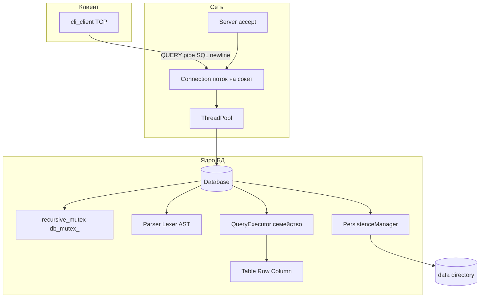
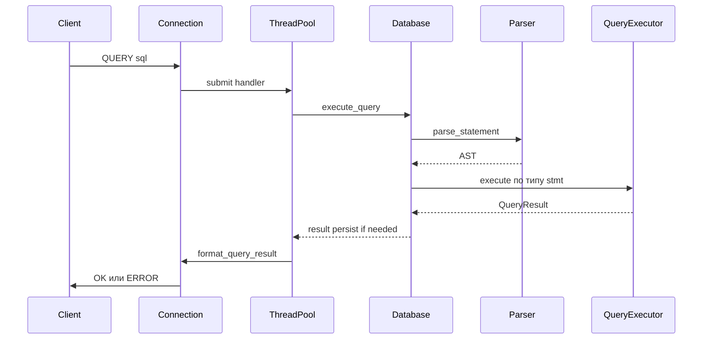

# Как устроен проект custom-sql-database

## Назначение

Репозиторий — **не production СУБД**, а демонстрация цепочки: **клиент → сеть → разбор SQL → выполнение над in-memory таблицами → (опционально) запись на диск**. Зависимости только от **стандартной библиотеки C++** и **POSIX** (сокеты, `pthread`).

Точка входа сервера: [`main.cc`](../main.cc) — создаётся [`Server`](../include/network/server.h) на порту **9000** с пулом из **4** потоков, затем `start()` / `wait()`.

## Основные слои (снизу вверх)

| Слой | Роль | Ключевые файлы |
|------|------|----------------|
| **Типы и значения** | `Value`, `DataType`, приведения | [`include/types/`](../include/types/), [`src/types/`](../src/types/) |
| **Модель данных** | `Table`, `Row`, `Column`, ограничения | [`include/core/`](../include/core/), [`src/core/`](../src/core/) |
| **Парсинг** | Lexer → tokens → Parser → AST (`std::variant` по типам stmt) | [`src/parser/lexer.cc`](../src/parser/lexer.cc), [`src/parser/parser.cc`](../src/parser/parser.cc), [`include/parser/ast.h`](../include/parser/ast.h) |
| **Выполнение** | Отдельные executor-классы для SELECT/INSERT/UPDATE/DELETE/CREATE | [`include/executor/query_executor.h`](../include/executor/query_executor.h), [`src/executor/query_executor.cc`](../src/executor/query_executor.cc) |
| **Персистенция** | Загрузка/сохранение каталога таблиц в `data/` | [`include/storage/persistence_manager.h`](../include/storage/persistence_manager.h), [`src/storage/persistence_manager.cc`](../src/storage/persistence_manager.cc) |
| **Сеть** | `accept`, поток на соединение + `ThreadPool` на обработку сообщения | [`src/network/server.cc`](../src/network/server.cc), [`include/network/protocol.h`](../include/network/protocol.h) |
| **Клиент** | TCP CLI, строки `QUERY\|...` | [`client/cli_client.cc`](../client/cli_client.cc) |

## Поток выполнения SQL

1. Клиент отправляет строку вида **`QUERY|<SQL>\n`** (см. [`Protocol`](../include/network/protocol.h)).
2. [`Connection::run`](../src/network/server.cc) читает сообщение, передаёт задачу в [`ThreadPool`](../include/threading/thread_pool.h).
3. Для `QUERY`: **`database->execute_query(sql)`** в [`Database`](../src/core/database.cc):
   - берётся **`std::lock_guard` на `db_mutex_`** — весь парсинг и выполнение **сериализованы** для всех клиентов;
   - **`Parser`** строит AST;
   - по типу узла вызывается `execute_select_statement` / `execute_insert_statement` / и т.д., внутри — соответствующий **QueryExecutor** и операции над **`Table`/`Row`**;
   - после успешных **INSERT/UPDATE/DELETE/CREATE TABLE** вызывается **`persist_after_mutation`** → **`PersistenceManager::save_database`**.
4. Ответ форматируется в **`Protocol::format_query_result`** (`OK|...` с TSV-строками или `ERROR|...`).

Фрагмент маршрутизации (диспетчер по типу statement):

```37:65:src/core/database.cc
QueryResult Database::execute_query(const std::string &sql) {
  std::lock_guard<std::recursive_mutex> lock(db_mutex_);

  try {
    DB_LOG_DEBUG("Executing query: ", sql);

    Parser parser(sql);
    auto stmt = parser.parse_statement();

    if (auto selectStmt =
            std::get_if<std::shared_ptr<SelectStatement>>(&stmt)) {
      return execute_select_statement(*selectStmt);
    }
    if (auto insertStmt =
            std::get_if<std::shared_ptr<InsertStatement>>(&stmt)) {
      return execute_insert_statement(*insertStmt);
    }
    if (auto updateStmt =
            std::get_if<std::shared_ptr<UpdateStatement>>(&stmt)) {
      return execute_update_statement(*updateStmt);
    }
    if (auto deleteStmt =
            std::get_if<std::shared_ptr<DeleteStatement>>(&stmt)) {
      return execute_delete_statement(*deleteStmt);
    }
    if (auto createStmt =
            std::get_if<std::shared_ptr<CreateTableStatement>>(&stmt)) {
      return execute_create_table_statement(*createStmt);
    }
```

## Конкурентность (важно)

- **Пул потоков** обрабатывает запросы, но **глобальный `recursive_mutex` в `Database`** фактически делает выполнение **последовательным** — параллелизм на уровне движка сейчас **не даёт выигрыша** по данным (инфраструктура «на будущее»).
- На каждое TCP-соединение — **отдельный поток чтения**; отправка защищена **`send_mutex_`** в `Connection`.

## Персистенция

- Каталог по умолчанию **`data/`** (аргумент конструктора `Server`).
- При старте: **`Database::load_from_disk`** → загрузка файлов таблиц.
- Формат: магическое число и версия в **`PersistenceManager`** (описано в [README](../README.md)).

## Ограничения (кратко)

Подробности — в [README «Features / Limitations»](../README.md): **JOIN, GROUP BY, ORDER BY, LIMIT** и др. **парсятся в AST**, но **SELECT-исполнитель их не применяет**; нет индексов и транзакций; размер запроса/ответа ограничен буферами чтения.

---

## Визуализация архитектуры





---

## Что читать дальше по коду

- Полный перечень поддерживаемого SQL и протокола: **[README.md](../README.md)**.
- Реализация фильтрации/выражений в SELECT: **[`src/executor/query_executor.cc`](../src/executor/query_executor.cc)**.
- Сериализация таблиц: **[`src/storage/persistence_manager.cc`](../src/storage/persistence_manager.cc)**.
